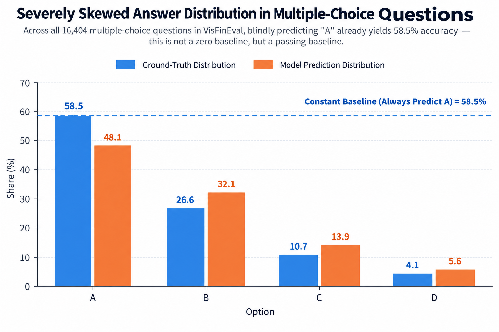
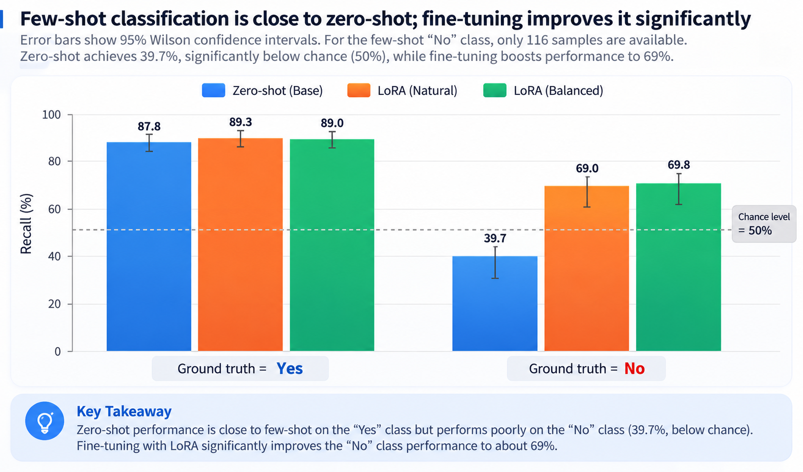
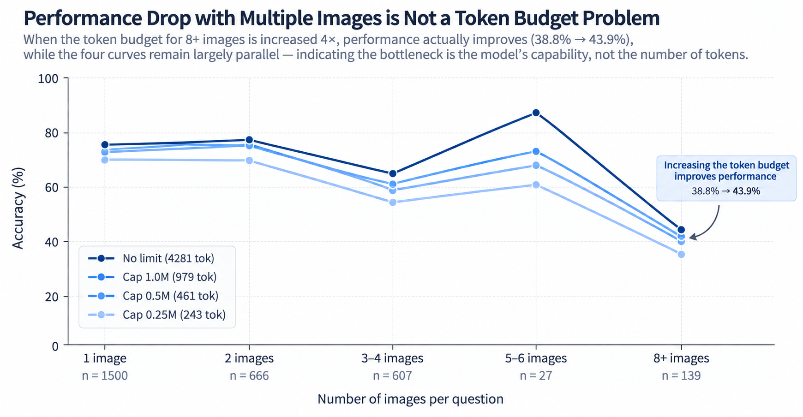
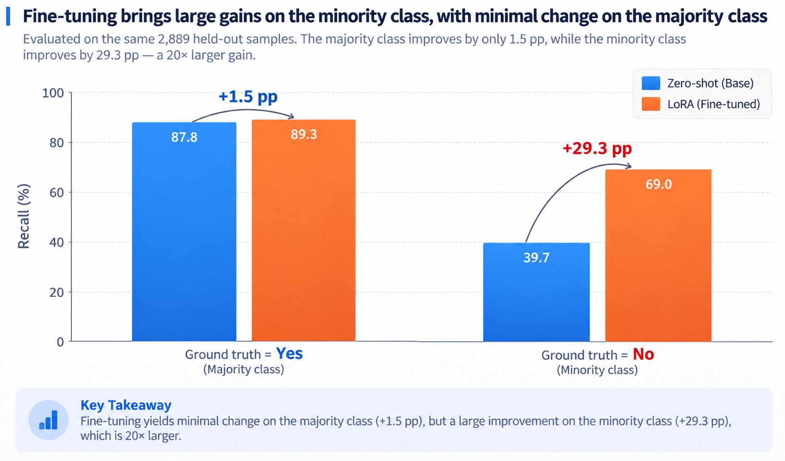

# FinVLM-Reliability

> **Beyond Raw Accuracy: Diagnostic Benchmarking & Robust Alignment for Financial VLMs**  
> *금융 멀티모달 대형 모델을 위한 신뢰성 진단 및 데이터 누수 방지 미세조정 벤치마크*

[](https://www.python.org/)
[](https://pytorch.org/)
[](https://github.com/QwenLM/Qwen3-VL)
[](https://github.com/modelscope/ms-swift)
[-792EE5.svg)](https://github.com/SUFE-AIFLM-Lab/VisFinEval)
[](LICENSE)

<p align="center">
  <a href="README.md">English</a> |
  <a href="README.zh-CN.md">简体中文</a> |
  <a href="README.zh-TW.md">繁體中文</a> |
  <b>한국어</b> |
  <a href="README.ja.md">日本語</a>
</p>

---

## 📢 뉴스 (News)

- **[2026-09]** 파인튜닝 후속 평가 결과 공개: LoRA 미세조정을 통해 진위형(T/F) 소수 클래스("아니오")의 재현율이 **+29.3%p ~ +30.1%p** 대폭 상승(39.7% → 69.0% / 69.8%), 샘플 단위 McNemar 검정 $p < 0.001$ 유의성 달성.
- **[2026-09]** 무누수 리포트 그룹 분할 시스템(70/15/15) 구축, 기존 벤치마크의 78% 교차 데이터 암기 위험을 완전 차단.
- **[2026-09]** Qwen3-VL-8B-Instruct 기반 19,208개 전수 제로샷 평가, 4단계 시각 토큰 예산 스윕 및 6개 프롬프트 강건성 스트레스 테스트 완료.

---

## 🌟 핵심 하이라이트 (Key Highlights)

- **0-데이터 누수 분할 프로토콜 (0-Leakage Protocol)**  
  VisFinEval은 훈련용 분할이 없으며, 19,208개 문항이 3,318건의 증권사 리포트에서 파생되었습니다. 무작위 분할 시 78%의 평가 샘플이 학습 시 노출됩니다. 본 프로젝트는 `doc_key` 기반 그룹 분할을 통해 완전한 물리적 격리를 보장합니다.
- **단순 정확도를 넘어서는 진단 (Beyond Raw Accuracy)**  
  Qwen3-VL-8B는 진위형 문항에서 단순 정확도(Raw Accuracy) 77.46%를 기록하지만, 소수 클래스("아니오")에 대한 재현율은 **39.7%**로 무작위 동전 던지기(50%)보다 현저히 낮습니다. 본 프로젝트는 과반수 상수 베이스라인, 매크로 재현율(Macro-Recall), 95% Wilson 신뢰구간을 함께 보고합니다.
- **다중 이미지 추론 붕괴 경계 (Multi-Image Breakdown Curve)**  
  문항당 차트 수가 증가함에 따른 명확한 성능 하락 곡선 규명: 8개 이상부터 성능이 붕괴하며, 10개 차트 문항에서는 29.5%로 단순 찍기 베이스라인보다 29.5%p 하락합니다. 해상도 소거 실험을 통해 이것이 토큰 예산 부족이 아닌 다중 이미지 교차 어텐션 처리 한계임을 입증했습니다.
- **엄밀한 쌍체 미세조정 정렬 (Rigorous Paired Alignment)**  
  ms-swift 기반 멀티 GPU LoRA 파이프라인 구축. 고정된 2,889개 테스트 샘플에서 쌍체 McNemar 정밀 검정을 수행하여, 미세조정 이득의 95% 이상이 붕괴되었던 소수 클래스 복구에 집중됨을 정량적으로 증명했습니다.

---

## 🏗️ 시스템 아키텍처 (System Architecture)

```
Raw Brokerage Reports (3,318 Docs, 19,208 QAs)
                      |
                      v
      [0-Leakage Report-Level Split]
      ├── Train (13,445) ── doc_key Grouping
      ├── Val    (2,874) ── 0 Overlap Assertion
      └── Test   (2,889) ── Fixed Global UID
                      |
        +-------------+-------------+
        |                           |
        v                           v
  [LoRA Natural]              [LoRA Balanced]
  Original Distribution       Upsampled Minority
  (422 steps / 1.6h)          (1,262 steps / 4.9h)
        |                           |
        +-------------+-------------+
                      |
                      v
  [Rigorous Paired Evaluation Harness]
  • Raw Accuracy vs Constant Baseline
  • Macro-Recall & Wilson 95% CI
  • Paired McNemar Exact Significance Test
```

---

## 📊 벤치마크 및 실험 결과 (Benchmark & Results)

모든 실험 조건은 완벽하게 동일한 2,889개 독립 테스트 샘플(Test Split)에서 그리디(Greedy) 디코딩 및 고정 UID로 측정되었습니다.

| 실험 조건 | 객관식 Raw | 다중이미지 객관식 | 진위형 Raw | 진위형 Macro | "아니오" 재현율 (95% Wilson CI) |
| :--- | :---: | :---: | :---: | :---: | :---: |
| **상수 베이스라인** (과반수 찍기) | 58.61% | -- | 73.87% | -- | -- |
| **Zero-shot** (기본 베이스) | 73.70% | 62.83% | 75.23% | 63.73% | 39.7% [31.2, 48.8] |
| **LoRA Natural** (자연 분포) | **84.13%** | **72.77%** | **84.01%** | 79.15% | 69.0% [60.1, 76.7] |
| **LoRA Balanced** (균형 리샘플링) | 82.78% | 68.06% | **84.01%** | **79.43%** | **69.8% [60.9, 77.4]** |
| **순수 향상 (Net Gain)** | **+10.43%p** | **+9.94%p** | **+8.78%p** | **+15.70%p** | **+30.1%p** |

---

## 🔬 핵심 진단 결과 (Core Diagnostic Findings)

### Finding 1 — 정답 분포 편향으로 인한 단순 정확도의 왜곡

<p align="center">
  
</p>

VisFinEval 전체 **16,404**개 객관식 문항 중 **58.5%의 정답이 "A"**입니다.  
차트를 보지 않고 무조건 `A`만 출력하는 더미 모델도 **58.5%의 정확도**를 얻습니다.  
따라서 상수 베이스라인은 바닥선이 아니라 **기본 통과 기준선(Passing Grade)**입니다.

| 지표 | 의미 |
| :--- | :--- |
| **Raw Accuracy** | 기존 벤치마크가 보고하는 정확도 (정답 편향에 크게 오염됨) |
| **Constant Baseline** | 항상 과반수 정답만 출력하는 기준선 (최소 합격선) |
| **Macro-Recall** | 클래스별 독립 재현율의 평균값 (분포 편향 없는 실제 능력) |

---

### Finding 2 — 소수 클래스 성능이 동전 던지기보다 열악한 현상

<p align="center">
  
</p>

진위형 문항 전체는 겉보기에 가장 우수해 보이지만(Raw 77.46%), 라벨별로 분해하면:

```
  정답      샘플 수(n)     비율       재현율
   예        2,063        73.6%      90.0%
 아니오        741        26.4%      42.5%    [95% CI 39.0–46.1]   ← 동전 던지기(50%) 이하
```

Raw 정확도와 Macro 재현율의 격차는 **11.20%p**에 달합니다. 모델은 과반수 클래스("예")로 퇴행하는 경향을 보입니다.

---

### Finding 3 — 다중 이미지 성능 하락은 토큰 예산 문제가 아닌 모델 역량의 한계

<p align="center">
  
</p>

포함된 차트 수가 늘어남에 따라 정확도가 급격히 하락합니다:

```
   차트 수     샘플 수 (n)     Raw Accuracy     상수 베이스라인     순수 마진
      2            666            75.5%             45.8%            +29.7%p
      4            227            61.7%             29.5%            +32.2%p
      8             60            50.0%             56.7%             -6.7%p (기준선 미달)
     10             78            29.5%             59.0%            -29.5%p (심각한 붕괴)
```

10개 차트 문항에서 모델은 "무조건 A 찍기"보다 29.5%p 낮은 점수를 기록합니다.

**시각 토큰 예산 부족이라는 직관적 가설은 실험을 통해 반증되었습니다.**  
프로세서 `longest_edge` 설정을 통해 4단계 토큰 예산 스윕(2,939 샘플 × 4단계)을 진행했습니다:

```
   토큰 예산        토큰/장    1장      2장     3-4장   5-6장   8장+     전체
   무제한 (no cap)   4281    74.7%    75.5%    62.1%   85.2%   38.8%    70.7%
   상한 1.0M          979    74.5%    74.8%    59.6%   70.4%   43.2%    70.0%
   상한 0.5M          461    72.5%    74.9%    56.3%   66.7%   43.9%    68.3%
   상한 0.25M         243    70.1%    69.7%    52.7%   59.3%   35.3%    64.6%
```

8장 이상 구간에서는 예산을 줄였을 때 오히려 정확도가 소폭 상승(38.8% → 43.9%)하며, 4단계 곡선이 모두 평행하게 하락합니다.  
**결론**: 다중 이미지 성능 하락의 병목은 입력 토큰 수가 아니라 교차 이미지 통합 어텐션 역량입니다.  
`longest_edge = 1M`은 정확도 손실 0.7%p로 토큰을 4.4배 절감하는 최적점입니다.

---

### Finding 4 — 프롬프트 표현에 따른 민감도 및 Raw 지표의 왜곡

4가지 프롬프트 변형으로 진위형 문항을 재평가한 결과 ($n = 2,804$):

```
  변형 버전                                Raw     상수 베이스라인   Macro    "아니오" 재현율
  base (기본 프롬프트)                    77.5%        73.6%        66.3%        42.5%
  nobias ("기본으로 '예' 찍지 말 것" 명시) 76.6%        73.6%        67.9%        49.3%
  correct_wrong ("예/아니오" → "참/거짓") 76.5%        73.6%        73.0%        65.6%
  ab_format (A/B 선택지 형태로 전환)       77.5%        73.6%        72.3%        61.3%
```

단순히 "예/아니오"를 "참/거짓"으로 교체하는 것만으로 소수 클래스 재현율이 **42.5%에서 65.6%로 급등**합니다.  
Raw 정확도 기준으로만 프롬프트를 튜닝하면 소수 클래스 성능이 가장 낮은 버전을 선택하게 되는 위험이 있습니다.

---

### Finding 5 — 미세조정을 통한 소수 클래스 붕괴 해결 및 집중도

2,889개 독립 테스트셋 평가 결과:

<p align="center">
  
</p>

```
  실험 조건             객관식 Raw   진위형 Raw   진위형 Macro   "아니오" 재현율 [95% CI]
  Zero-shot (베이스)    73.70%       75.23%       63.73%        39.7% [31.2, 48.8]
  LoRA Natural          84.13%       84.01%       79.15%        69.0% [60.1, 76.7]
  LoRA Balanced         82.78%       84.01%       79.43%        69.8% [60.9, 77.4]
```

샘플 단위 McNemar 쌍체 검정:
- Zero-shot → LoRA Natural: 정답 전환 430건, 오답 전환 136건, 순수 개선 **+294건** ($p < 0.001$, 극도로 유의)
- 과반수("예") 재현율: 87.8% → 89.3% (+1.5%p)
- 소수("아니오") 재현율: 39.7% → 69.0% (**+29.3%p, 20배 집중**)

**Negative Finding**: 클래스 균형 리샘플링(Balanced)은 추가적인 유의미한 이득을 주지 못했습니다(객관식 Raw 1.35%p 하락). 일반 자연 분포에서의 지도학습 미세조정만으로도 충분히 모델의 식별 역량이 복원됩니다.

---

## 🚀 빠른 시작 (Quick Start)

```bash
# 1. 환경 구축 (~10분)
git clone https://github.com/gavinzsmeng/visfineval-reliability.git
cd visfineval-reliability
bash scripts/setup_env.sh

# 2. 데이터 및 가중치 다운로드
bash scripts/hf.sh download SUFE-AIFLM-Lab/VisFinEval --repo-type dataset --local-dir data/VisFinEval
bash scripts/hf.sh download Qwen/Qwen3-VL-8B-Instruct --local-dir models/Qwen3-VL-8B-Instruct
7z x data/VisFinEval/data.7z -odata/VisFinEval/

# 3. 무누수 데이터셋 분할
python scripts/prepare_data.py --out data/swift     --balance natural
python scripts/prepare_data.py --out data/swift_bal --balance balanced

# 4. 멀티 GPU LoRA 학습 실행
bash scripts/run_lora.sh natural
bash scripts/run_lora.sh balanced

# 5. 사후 쌍체 평가 자동 실행
bash scripts/run_posttrain_eval.sh
```

---

## 🛠️ 코드베이스 구조 (Codebase Structure)

```
├── configs/                  # 분산 학습 및 DeepSpeed 설정
├── data/                     # 리포트 단위 무누수 데이터 분할 결과
├── models/                   # 베이스 모델 디렉토리 (Qwen3-VL-8B-Instruct)
├── output/                   # 학습 체크포인트 및 로그
├── results/                  # 평가 예측 결과 (jsonl) 및 지표 요약
│   ├── RESULTS.md            # 상세 실험 기록 및 소거 레저
│   ├── zeroshot/             # 제로샷 베이스라인 예측
│   ├── posttrain_*/          # 파인튜닝 평가 결과
│   └── sensitivity/          # 프롬프트 민감도 테스트 결과
├── scripts/                  # 프로덕션 파이프라인 스크립트
│   ├── prepare_data.py       # 무누수 분할 및 포맷팅
│   ├── eval_baseline.py      # 멀티 GPU 평가 하네스
│   ├── run_lora.sh           # LoRA 학습 실행기
│   ├── run_posttrain_eval.sh # 사후 쌍체 평가 오케스트레이터
│   └── compare_conditions.py # McNemar 검정 및 Wilson 신뢰구간
└── requirements.lock.txt     # 고정된 의존성 목록
```

---

## 📜 저작권 및 라이선스 고지 (Copyright & Notice)

⚠ **본 저장소는 VisFinEval의 원본 이미지를 직접 호스팅하지 않습니다.**  
이미지는 각 증권사 공개 리포트에서 파생되었으며 저작권은 원저작자에게 있습니다.
공식 채널을 통해 취득하시기 바랍니다:
- HuggingFace: [SUFE-AIFLM-Lab/VisFinEval](https://huggingface.co/datasets/SUFE-AIFLM-Lab/VisFinEval)
- GitHub: [SUFE-AIFLM-Lab/VisFinEval](https://github.com/SUFE-AIFLM-Lab/VisFinEval)

본 저장소는 **코드, 데이터 분할 로직 및 평가 결과만을 배포합니다.**

---

## 📑 인용 (Citation)

```bibtex
@misc{meng2026visfinevalrel,
  title  = {VisFinEval Reliability Audit: what reported accuracy hides},
  author = {Meng, Gavin C.},
  year   = {2026},
  url    = {https://github.com/gavinzsmeng/visfineval-reliability}
}
```

원천 VisFinEval 벤치마크 인용:

```bibtex
@inproceedings{visfineval2025,
  title     = {VisFinEval: A Scenario-Driven Chinese Multimodal Benchmark for Holistic Financial Understanding},
  booktitle = {EMNLP},
  year      = {2025}
}
```

---

## 📄 라이선스 (License)

본 프로젝트는 [Apache-2.0](LICENSE) 라이선스를 따릅니다.
