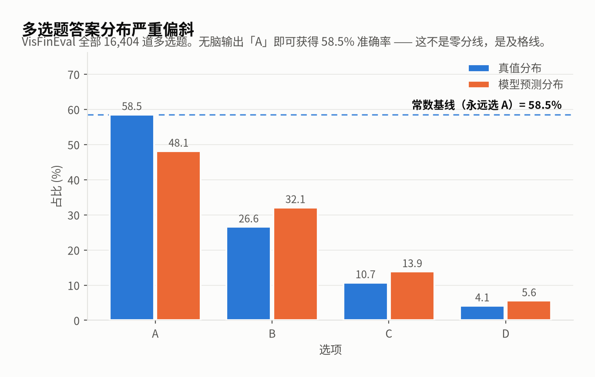
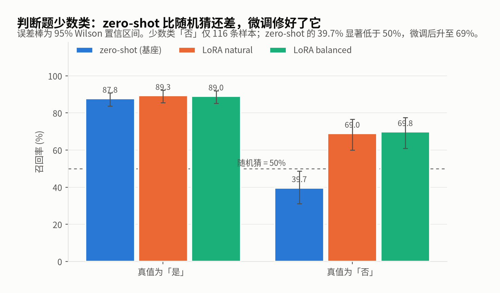
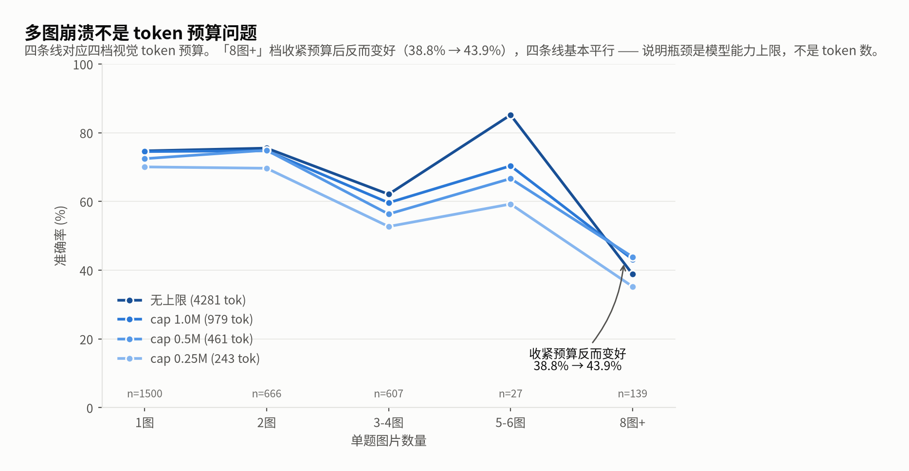
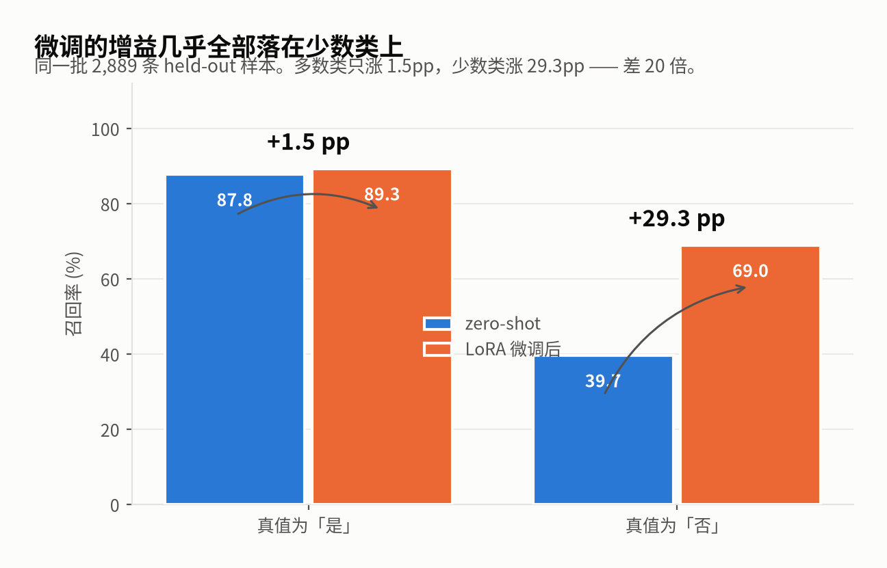

# VisFinEval Reliability Audit

**English** · [中文](README.zh-CN.md)

> A reproducibility and reliability audit of [VisFinEval](https://github.com/SUFE-AIFLM-Lab/VisFinEval),
> a Chinese financial multimodal benchmark. Not *"how accurate is this model"* — but
> *"what is the reported accuracy hiding?"*

VisFinEval (EMNLP 2025) reports its best model, Qwen-VL-max, at **76.3%**. That number is
computed as raw accuracy over a multiple-choice task whose answers are severely skewed.
This repository quantifies that skew, shows what it conceals, and provides the tooling to
reproduce every number.

---

## Finding 1 — The answer distribution makes raw accuracy nearly meaningless

<picture>
  <source media="(prefers-color-scheme: dark)" srcset="assets/fig1_answer_distribution_dark.png">
  
</picture>

Across all **16,404** multiple-choice questions in VisFinEval, **58.5% of gold answers are "A"**.

A model that always outputs `A` — doing no vision, no reading, no reasoning — scores **58.5%**.
That is not a floor; it is **the passing grade**. Any reported score must be read against it.

We report three numbers for every result:

| Metric | What it means |
|---|---|
| **raw accuracy** | what benchmark papers report |
| **constant baseline** | always emit the majority class — the passing grade |
| **macro-recall** | mean per-class recall — uncontaminated by the answer skew |

---

## Finding 2 — The model is worse than random on the minority class

<picture>
  <source media="(prefers-color-scheme: dark)" srcset="assets/fig2_minority_recall_dark.png">
  
</picture>

True/False questions look like the *best* category (raw 77.46%), but split by label:

```
  gold      n     share    recall
  是     2,063    73.6%    90.0%
  否       741    26.4%    42.5%    [95% CI 39.0–46.1]   ← below chance (50%)
```

Raw accuracy minus macro-recall is **11.20 pp** — the largest gap in the entire dataset.
The model collapses onto the majority class, but not completely (it answers "否" 520 times
and gets only 315 right).

---

## Finding 3 — The multi-image collapse is a capability limit, not a token budget problem

<picture>
  <source media="(prefers-color-scheme: dark)" srcset="assets/fig3_multi_image_curve_dark.png">
  
</picture>

Accuracy falls monotonically with the number of images per question:

```
  images    n      raw     constant baseline    lift
    2      666    75.5%        45.8%           +29.7pp
    4      227    61.7%        29.5%           +32.2pp
    8       60    50.0%        56.7%            -6.7pp
   10       78    29.5%        59.0%           -29.5pp   ← worse than guessing "A"
```

On 10-image questions the model scores **29.5 pp below** the do-nothing baseline.
Multi-period comparison is *the* real financial-analysis workflow, so this ceiling matters.

**The obvious hypothesis — running out of visual token budget — is wrong.**
We swept the processor's `longest_edge` across four settings (2,939 samples × 4):

```
   budget     tok/img    1img   2img   3-4img  5-6img  8+img   overall
   no cap       4281     74.7%  75.5%   62.1%  85.2%   38.8%   70.7%
   cap 1.0M      979     74.5%  74.8%   59.6%  70.4%   43.2%   70.0%
   cap 0.5M      461     72.5%  74.9%   56.3%  66.7%   43.9%   68.3%
   cap 0.25M     243     70.1%  69.7%   52.7%  59.3%   35.3%   64.6%
```

The **8+ image** bucket gets *better* when the budget is tightened (38.8% → 43.9%), and
the curve shape is stable across all four budgets (relative to single-image:
−35.9 / −31.4 / −28.6 / −34.8 pp). So the bottleneck is the model's ability to integrate
many images, not the number of tokens it receives.

**A practical side result:** `longest_edge = 1M` is a safe operating point —
it cuts visual tokens 4.4× for a 0.7 pp loss. Below 0.5M the cost rises quickly.

> A configuration gotcha worth knowing: `MAX_PIXELS` is a **ms-swift** convention.
> Transformers' processor ignores it entirely. The processor default is
> `longest_edge=16777216` — effectively no cap. If you think you set a resolution limit
> via that env var, you probably didn't.

---

## Finding 4 — The result depends on wording, and raw accuracy points the wrong way

We re-ran the True/False split under four prompt phrasings (n = 2,804 each):

```
  variant                                 raw    const. base   macro   recall「否」
  base                                 77.5%      73.6%      66.3%      42.5%
  nobias (explicit "don't default to 是") 76.6%      73.6%      67.9%      49.3%
  correct_wrong (是/否 → 正确/错误)       76.5%      73.6%      73.0%      65.6%
  ab_format (A/B options)              77.5%      73.6%      72.3%      61.3%
```

Three things follow:

1. **The minority-class collapse is a property of the model** — it reproduces under all
   four phrasings (「否」recall is 22–48 pp below 「是」 in every one).
2. **But wording moves it enough to change the conclusion.** Simply swapping 是/否 for
   正确/错误 lifts minority recall from **42.5% to 65.6%**.
3. **Raw accuracy and macro-recall point in opposite directions.** *Every* variant's raw
   accuracy is equal to or worse than base (paired net −27 / −23 / 0), while macro-recall
   gains up to 6.7 pp. **Tuning prompts by raw accuracy selects the worst variant.**

The explicit debiasing instruction (`nobias`) made things *worse* (net −23) — the model
is not failing because it doesn't know it should balance. It can't.

Multiple-choice questions are insensitive to wording (<1.5 pp). **The two question types
do not have the same evaluation reliability.**

---

## Finding 5 — Fine-tuning *does* fix the minority collapse (and class balancing doesn't help)

On 2,889 held-out test samples (split by source document, zero overlap with training):

<picture>
  <source media="(prefers-color-scheme: dark)" srcset="assets/fig4_gain_concentration_dark.png">
  
</picture>

```
  condition              MC raw   TF raw   TF macro   「否」recall [95% CI]
  zero-shot (base)      73.70%   75.23%    63.73%    39.7% [31.2, 48.8]
  LoRA natural          84.13%   84.01%    79.15%    69.0% [60.1, 76.7]
  LoRA balanced         82.78%   84.01%    79.43%    69.8% [60.9, 77.4]
```

Paired per-sample comparison (same `uid`):

```
  zero-shot -> LoRA natural      fixed 430   broke 136   net +294   McNemar p < 0.001
  zero-shot -> LoRA balanced     fixed 428   broke 167   net +261   McNemar p < 0.001
```

**The gain is concentrated almost entirely on the minority class:**

```
  是 recall (n=328)    87.8%  ->  89.3%     +1.5pp
  否 recall (n=116)    39.7%  ->  69.0%    +29.3pp      ← a 20× difference
```

**Negative result:** class-balanced resampling (all 6 question-type × label combinations
upsampled to 6,725 each) gave **no benefit** — MC raw dropped 1.35 pp (p = 0.024) and the
minority recall difference is within noise. The collapse was **not** caused by imbalanced
training data; ordinary SFT on the natural distribution already fixes it.

---

## Quick start

```bash
# 1. Environment (~10 min)
bash scripts/setup_env.sh

# 2. Data and weights
bash scripts/hf.sh download SUFE-AIFLM-Lab/VisFinEval --repo-type dataset --local-dir data/VisFinEval
bash scripts/hf.sh download Qwen/Qwen3-VL-8B-Instruct --local-dir models/Qwen3-VL-8B-Instruct
7z x data/VisFinEval/data.7z -odata/VisFinEval/

# 3. Zero-shot evaluation (~35 min on 4 GPUs)
bash scripts/run_eval.sh
python scripts/analyze_results.py --dir results/zeroshot
```

> `scripts/hf.sh` is a wrapper that works around a SOCKS-proxy/httpx incompatibility on
> our machine. You probably don't need it.

Full reproduction: see `results/RESULTS.md`, which documents every experiment including
the prompt-sensitivity sweep, the LoRA conditions, and the token-budget sweep.

---

## Method notes

### Why splitting must be by source document

VisFinEval is a benchmark — **it has no train split.** Its 19,208 questions come from
3,318 broker research reports (5.8 questions per report on average; the largest contributes
161). A random sample-level split would put the **same report** on both sides for **78%**
of training rows — the model could memorize a report's layout and numbers instead of
learning to read charts.

We split by `doc_key` (70/15/15) so every question from a report lands on one side, and
the pipeline self-checks for leakage.

### Why three metrics, and why the statistics

```
raw accuracy    contaminated by the answer distribution
macro-recall    mean per-class recall, distribution-independent
constant base   the passing grade, not the floor
```

Minority classes are small (the test split has only 116 「否」 questions), so we report
**Wilson confidence intervals** for proportions and use **McNemar's exact test** for
paired condition comparisons.

---

## Limitations

- Only Qwen-family models tested so far; cross-family comparison is in progress
- Single seed; greedy decoding (no sampling-variance estimate)
- No image-order randomization test for multi-image robustness
- 1,032 rows with empty `answer` in `L2_Q1.tsv` were dropped; `L3_Q4.tsv` has a different
  schema and is excluded
- **The split is ours, not VisFinEval's.** Numbers here are not directly comparable to the
  paper's or the leaderboard's, and any citation must say so

---

## Data copyright

⚠ **This repository does not host VisFinEval's images.** They originate from broker
research reports and are copyrighted. Obtain them from the official sources:

- HuggingFace: [`SUFE-AIFLM-Lab/VisFinEval`](https://huggingface.co/datasets/SUFE-AIFLM-Lab/VisFinEval)
- GitHub: [SUFE-AIFLM-Lab/VisFinEval](https://github.com/SUFE-AIFLM-Lab/VisFinEval)

This repository publishes **code, splitting logic, and evaluation results only.**

---

## License

[Apache-2.0](LICENSE) © 2026 Gavin C. Meng

## Citation

```bibtex
@misc{meng2026visfinevalrel,
  title  = {VisFinEval Reliability Audit: what reported accuracy hides},
  author = {Meng, Gavin C.},
  year   = {2026},
  url    = {https://github.com/gavinzsmeng/visfineval-reliability}
}
```

Please also cite the underlying benchmark:

```bibtex
@inproceedings{visfineval2025,
  title     = {VisFinEval: A Scenario-Driven Chinese Multimodal Benchmark
               for Holistic Financial Understanding},
  booktitle = {EMNLP},
  year      = {2025}
}
```
