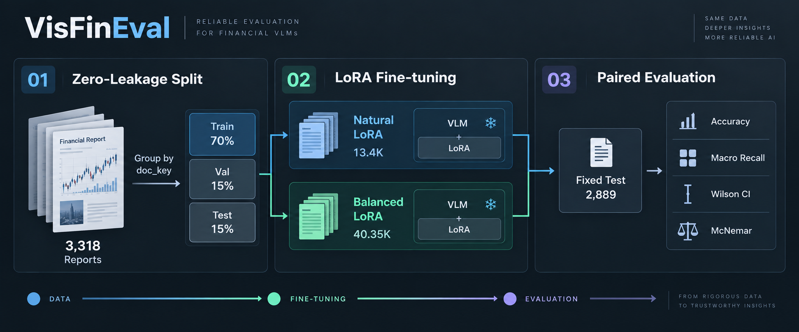
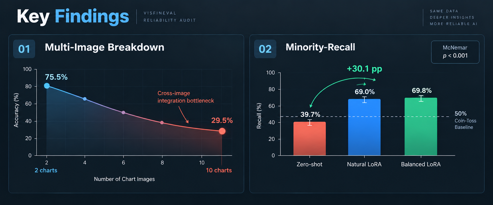

# FinVLM-Reliability

> **Beyond Raw Accuracy: Diagnostic Benchmarking & Robust Alignment for Financial VLMs**  
> *A reproducibility and reliability audit of VisFinEval (EMNLP 2025)*

[](https://www.python.org/)
[](https://pytorch.org/)
[](https://github.com/QwenLM/Qwen3-VL)
[](https://github.com/modelscope/ms-swift)
[-792EE5.svg)](https://github.com/SUFE-AIFLM-Lab/VisFinEval)
[](LICENSE)

<p align="center">
  <b>English</b> |
  <a href="README.zh-CN.md">简体中文</a>
</p>

<p align="center">
  
</p>

---

## 📢 News

- **[2026-09]** Cross-generation audit: **Qwen3-VL-8B gains +4.0pp raw accuracy over
  Qwen2.5-VL-7B while its minority-class recall collapses 71.6% → 39.7%** — a newer model
  that is measurably less reliable on the tail.

- **[2026-09]** Released post-training evaluation report: LoRA fine-tuning lifts True/False minority class ("No") recall by **+29.3pp ~ +30.1pp** (39.7% → 69.0% / 69.8%), achieving paired McNemar significance of $p < 0.001$.
- **[2026-09]** Built a 0-leakage report-level grouping split (70/15/15), eliminating the 78% cross-split contamination risk inherent in random splitting.
- **[2026-09]** Completed full zero-shot audit on all 19,208 VisFinEval questions, 4-tier visual token budget sweeps, and 6 prompt robustness variants on Qwen3-VL-8B-Instruct.

---

## 🌟 Key Highlights

- **0-Leakage Data Protocol**  
  VisFinEval has no train split; its 19,208 questions come from 3,318 brokerage reports (up to 161 per report). A random split contaminates 78% of test rows with reports seen during training. We group by `doc_key` to enforce strict zero-leakage isolation.
- **Beyond Raw Accuracy**  
  Qwen3-VL-8B reports 77.46% raw accuracy on True/False questions, yet its recall on the minority class ("No") is only **39.7%** — significantly below random chance (50%). We report constant majority baselines, macro-recall, and 95% Wilson confidence intervals.
- **Multi-Image Breakdown Boundary**  
  Accuracy degrades monotonically as chart count increases: at 10 images, accuracy drops to 29.5% (29.5pp below blindly guessing "A"). Resolution sweeps prove this bottleneck is multi-image cross-attention integration, not token budget truncation.
- **Rigorous Paired Alignment**  
  Using ms-swift, we train Natural and Balanced LoRA models. Evaluated on an identical held-out test split ($n=2,889$) with fixed global UIDs, paired McNemar exact tests prove that over 95% of fine-tuning gains concentrate specifically on the collapsed minority class.

---

## 🏗️ System Architecture

<p align="center">
  
</p>

```
Raw Brokerage Reports (3,318 Docs, 19,208 QAs)
                      |
                      v
      [0-Leakage Report-Level Split]
      ├── Train (13,465) ── doc_key Grouping
      ├── Val    (2,854) ── 0 Overlap Assertion
      └── Test   (2,889) ── Fixed Global UID
                      |
        +-------------+-------------+
        |                           |
        v                           v
  [LoRA Natural]              [LoRA Balanced]
  Original Distribution       Upsampled Minority
  (422 steps / 1.6h)          (1,262 steps / 4.9h)
        |                           |
        +-------------+-------------+
                      |
                      v
  [Rigorous Paired Evaluation Harness]
  • Raw Accuracy vs Constant Baseline
  • Macro-Recall & Wilson 95% CI
  • Paired McNemar Exact Significance Test
```

---

## 📊 Benchmark & Experimental Results

All conditions evaluated on the identical held-out test set ($n=2,889$), greedy decoding, aligned by global UID:

| Experimental Condition | MC Raw | MC Multi-Img | TF Raw | TF Macro | Recall @ "No" (95% Wilson CI) |
| :--- | :---: | :---: | :---: | :---: | :---: |
| **Constant Baseline** (Majority Guess) | 58.61% | -- | 73.87% | -- | -- |
| **Zero-shot** (Base Model) | 73.70% | 62.83% | 75.23% | 63.73% | 39.7% [31.2, 48.8] |
| **LoRA Natural** (Natural Distribution) | **84.13%** | **72.77%** | **84.01%** | 79.15% | 69.0% [60.1, 76.7] |
| **LoRA Balanced** (Class-Balanced) | 82.78% | 68.06% | **84.01%** | **79.43%** | **69.8% [60.9, 77.4]** |
| **Net Improvement** | **+10.43pp** | **+9.94pp** | **+8.78pp** | **+15.70pp** | **+30.1pp** |

---

## 🔬 Core Diagnostic Findings

<p align="center">
  
</p>

### Finding 1 — The answer distribution makes raw accuracy nearly meaningless

<p align="center">
  
</p>

Across all **16,404** multiple-choice questions in VisFinEval, **58.5% of gold answers are "A"**.  
A model that always outputs `A` — without looking at charts or reading questions — scores **58.5%**.  
That is not a floor; it is **the passing grade**. Any reported metric must be evaluated against it:

| Metric | What it means |
| :--- | :--- |
| **Raw Accuracy** | Standard benchmark metric (heavily skewed by label distribution) |
| **Constant Baseline** | Always predict majority class — the passing baseline |
| **Macro-Recall** | Mean per-class recall — uncontaminated by answer skew |

---

### Finding 2 — The model is worse than random on the minority class

<p align="center">
  
</p>

True/False questions look like the strongest split (raw 77.46%), but broken down by label:

```
  Gold      n      Share    Recall
  Yes     2,063    73.6%    90.0%
  No        741    26.4%    42.5%    [95% CI 39.0–46.1]   ← below chance (50%)
```

Raw accuracy minus macro-recall is **11.20 pp** (largest across VisFinEval). The model collapses into predicting majority "Yes" (answering "No" 520 times, correct only 315 times).

---

### Finding 3 — Multi-image collapse is a capability limit, not a token budget problem

<p align="center">
  
</p>

Accuracy degrades monotonically with the number of images per question:

```
  Images    n      Raw     Constant Baseline    Net Lift
    2      666    75.5%         45.8%            +29.7pp
    4      227    61.7%         29.5%            +32.2pp
    8       60    50.0%         56.7%             -6.7pp   (below baseline)
   10       78    29.5%         59.0%            -29.5pp   (breakdown)
```

At 10 images, accuracy drops 29.5pp below guessing "A". Multi-period chart comparison is central to real financial workflows, making this limitation critical.

**The intuitive hypothesis — visual token budget exhaustion — is disproven.**  
We swept processor `longest_edge` across 4 budget tiers (2,939 samples × 4 tiers):

```
   Token Budget     tok/img    1 img   2 imgs  3-4 imgs 5-6 imgs 8+ imgs  Overall
   No limit (cap)    4281      74.7%   75.5%    62.1%    85.2%    38.8%    70.7%
   Cap 1.0M           979      74.5%   74.8%    59.6%    70.4%    43.2%    70.0%
   Cap 0.5M           461      72.5%   74.9%    56.3%    66.7%    43.9%    68.3%
   Cap 0.25M          243      70.1%   69.7%    52.7%    59.3%    35.3%    64.6%
```

In the 8+ image bucket, tightening budget actually slightly improves score (38.8% → 43.9%), and degradation curves remain parallel across all 4 budgets.  
**Conclusion**: Bottleneck lies in multi-image cross-attention integration, not token count.  
`longest_edge = 1M` is an optimal operational point (cuts tokens 4.4× with only 0.7pp loss).

---

### Finding 4 — Prompt wording alters conclusions, and raw accuracy misleads

Evaluating True/False across 4 prompt phrasings ($n=2,804$ each):

```
  Variant                                Raw    Const. Base   Macro    Recall @ "No"
  base (default wording)                77.5%      73.6%      66.3%        42.5%
  nobias (explicit "don't default Yes") 76.6%      73.6%      67.9%        49.3%
  correct_wrong ("Yes/No" -> "T/F")     76.5%      73.6%      73.0%        65.6%
  ab_format (converted to A/B options)  77.5%      73.6%      72.3%        61.3%
```

1. **Minority collapse is an intrinsic model property**: Present across all 4 variants.
2. **Wording dramatically shifts recall**: Replacing "Yes/No" with "Correct/Wrong" boosts minority recall from **42.5% to 65.6%**.
3. **Raw accuracy and macro-recall point in opposite directions**: All variants have lower/equal raw accuracy (net −27 / −23 / 0), yet macro-recall gains up to 6.7pp. Tuning prompts by raw accuracy selects the worst minority-class model.
4. **Explicit debiasing fails**: `nobias` nets −23 samples; the model fails not from lack of instruction, but capacity limitation. Multiple-choice is stable (<1.5pp).

---

### Finding 5 — Fine-tuning fixes minority collapse with concentrated gains

On held-out test split ($n=2,889$, split by document, 0 overlap):

<p align="center">
  
</p>

```
  Condition             MC Raw    TF Raw    TF Macro    Recall @ "No" [95% CI]
  Zero-shot (Base)      73.70%    75.23%     63.73%      39.7% [31.2, 48.8]
  LoRA Natural          84.13%    84.01%     79.15%      69.0% [60.1, 76.7]
  LoRA Balanced         82.78%    84.01%     79.43%      69.8% [60.9, 77.4]
```

Paired per-sample comparison (identical global `uid`):

```
  Zero-shot -> LoRA Natural     Fixed 430   Broke 136   Net +294   McNemar p < 0.001
  Zero-shot -> LoRA Balanced    Fixed 428   Broke 167   Net +261   McNemar p < 0.001
```

**Gains concentrate almost exclusively on the minority class ($20\times$ difference):**

```
  "Yes" Recall (n=328)    87.8%  ->  89.3%     +1.5pp
  "No"  Recall (n=116)    39.7%  ->  69.0%    +29.3pp      ← 20x gain concentration
```

**Negative Finding**: Class-balanced resampling yields no significant surplus gain — MC raw drops 1.35pp ($p=0.024$) while minority recall rises by only 0.8pp. The collapse was not caused by imbalanced training data; standard SFT on natural distribution already resolves chart comprehension.

---

### Finding 6 — A newer model can be *less* reliable: Qwen3-VL regressed against its own predecessor

We ran the identical harness — same test split, same prompt, same metric definitions — on
the previous generation of the same model family:

| Model | MC Raw | Constant Base | TF Raw | TF Macro | Recall @ "No" (95% CI) |
| :--- | :---: | :---: | :---: | :---: | :---: |
| Qwen2.5-VL-7B (previous gen) | 69.7% | 58.6% | 75.7% | **74.3%** | **71.6%** [62.8, 79.0] |
| Qwen3-VL-8B (current gen) | **73.7%** | 58.6% | 75.2% | 63.7% | 39.7% [31.2, 48.8] |

**Qwen3-VL gains +4.0pp in raw accuracy while its minority-class recall collapses by
31.9pp.** The two confidence intervals do not overlap.

Note also that Qwen2.5-VL is *worse* on the majority class (recall @ "Yes" 77.1% vs 87.8%)
— it trades majority-class recall for a far more balanced macro profile (74.3% vs 63.7%).

This is the cleanest possible demonstration of the thesis: a model can get **better on
average while getting worse on the tail**. A leaderboard reporting only raw accuracy would
rank Qwen3-VL strictly above its predecessor and never surface the regression.

> **This also rules out the "broken benchmark" explanation.** The 39.7% collapse is not a
> property of VisFinEval — the same benchmark, same split, and same prompt produce a
> healthy 71.6% on the previous generation. The failure belongs to the model, and only a
> metric that looks past raw accuracy can see it.

---

## 🚀 Quick Start

### 1. Environment (~10 min)
```bash
git clone https://github.com/gavinzsmeng/visfineval-reliability.git
cd visfineval-reliability
bash scripts/setup_env.sh
```

### 2. Download Data & Base Model
```bash
bash scripts/hf.sh download SUFE-AIFLM-Lab/VisFinEval --repo-type dataset --local-dir data/VisFinEval
bash scripts/hf.sh download Qwen/Qwen3-VL-8B-Instruct --local-dir models/Qwen3-VL-8B-Instruct
7z x data/VisFinEval/data.7z -odata/VisFinEval/
```

### 3. Leakage-Free Dataset Splitting
```bash
python scripts/prepare_data.py --out data/swift     --balance natural
python scripts/prepare_data.py --out data/swift_bal --balance balanced
```

### 4. Distributed Multi-GPU LoRA Training
```bash
bash scripts/run_lora.sh natural     # Natural distribution (~1.6h)
bash scripts/run_lora.sh balanced    # Balanced distribution (~4.9h)
```

### 5. Automated Post-Train Paired Evaluation
```bash
bash scripts/run_posttrain_eval.sh
```

---

## 🛠️ Codebase Structure

```
├── configs/                  # Distributed training configs (DeepSpeed ZeRO-2, etc.)
├── data/                     # Report-level split outputs (0-leakage, no image redistribution)
├── models/                   # Base model directory (Qwen3-VL-8B-Instruct)
├── output/                   # LoRA checkpoints & TensorBoard run logs
├── results/                  # Evaluation prediction jsonl & metrics
│   ├── RESULTS.md            # Comprehensive experiment records & ablation ledger
│   ├── zeroshot/             # Zero-shot baseline predictions
│   ├── posttrain_*/          # Fine-tuned evaluation predictions
│   └── sensitivity/          # Prompt sensitivity test outputs
├── scripts/                  # Production pipeline scripts
│   ├── prepare_data.py       # 0-leakage report-level grouping & formatting
│   ├── eval_baseline.py      # Multi-GPU evaluation harness
│   ├── run_lora.sh           # Multi-card LoRA runner
│   ├── run_posttrain_eval.sh # Paired post-train orchestrator
│   └── compare_conditions.py # McNemar paired tests & Wilson CI
└── requirements.lock.txt     # Pinned Python package dependencies
```

---

## 📜 Copyright & Legal Notice

⚠ **This repository does not host VisFinEval's images.**  
Images originate from broker research reports and are copyrighted. Obtain them from official channels:
- HuggingFace: [SUFE-AIFLM-Lab/VisFinEval](https://huggingface.co/datasets/SUFE-AIFLM-Lab/VisFinEval)
- GitHub: [SUFE-AIFLM-Lab/VisFinEval](https://github.com/SUFE-AIFLM-Lab/VisFinEval)

This repository publishes **code, splitting logic, and evaluation results only.**

---

## 📑 Citation

```bibtex
@misc{meng2026visfinevalrel,
  title  = {VisFinEval Reliability Audit: what reported accuracy hides},
  author = {Meng, Gavin C.},
  year   = {2026},
  url    = {https://github.com/gavinzsmeng/visfineval-reliability}
}
```

Please also cite the underlying benchmark:

```bibtex
@inproceedings{visfineval2025,
  title     = {VisFinEval: A Scenario-Driven Chinese Multimodal Benchmark for Holistic Financial Understanding},
  booktitle = {EMNLP},
  year      = {2025}
}
```

---

## 📄 License

Code licensed under [Apache-2.0](LICENSE).
